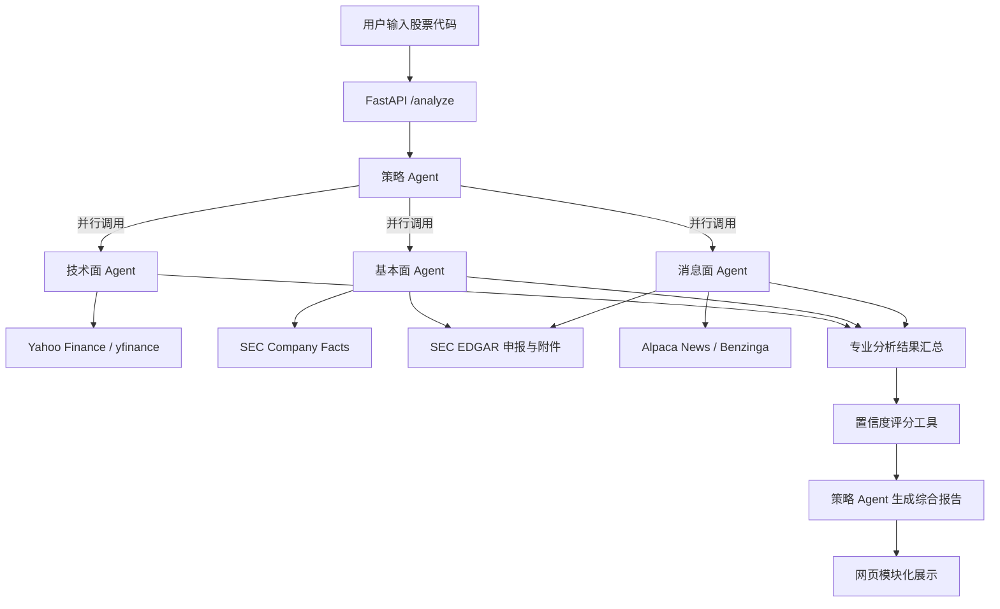

# US Stock Multi-Agent Analysis System

一个基于 Python、FastAPI 和 OpenAI Agents SDK 构建的美股多 Agent 分析系统。

用户输入股票代码后，系统会分别调用技术面、基本面和消息面 Agent，最后由策略 Agent 汇总结果，并通过网页生成结构化中文分析报告。

## 项目功能

- 技术面分析
  - 5日、20日和60日收益率
  - 20日、50日和200日均线
  - RSI
  - 成交量变化
  - 支撑位与阻力位

- 基本面分析
  - 营业收入和净利润
  - 收入及净利润同比增长
  - 经营现金流、资本支出和自由现金流
  - 现金、债务、资产和股东权益
  - 支持从 SEC 申报及附件中补充外国发行人的数据

- 消息面分析
  - 获取近期相关新闻
  - 股票代码相关性筛选
  - 新闻去重
  - 来源质量提示
  - 结合 SEC 8-K、6-K 和相关附件进行核验

- 综合分析
  - 对比技术面、基本面和消息面信号
  - 识别不同分析之间的支持与矛盾
  - 输出正面因素、风险因素和后续关注事项
  - 根据数据完整性、时效性和来源质量计算置信度

## 系统架构

本项目采用“总 Agent 统筹、专业 Agent 独立分析”的架构。三个专业 Agent 不直接互相调用或共享内部数据，而是分别完成自己的分析，再将结果返回给策略 Agent。



三个专业 Agent 之间保持数据边界：

- 技术面 Agent 只处理价格、均线、RSI、成交量和支撑阻力数据。
- 基本面 Agent 只处理 SEC 财务指标、现金流、资本结构及申报正文。
- 消息面 Agent 只处理新闻、来源质量、相关性和近期 SEC 重大事项。
- 策略 Agent 是唯一负责比较三类结果、识别矛盾并形成最终判断的 Agent。

## Agent 调用与任务规划

### 1. 请求接收与任务创建

FastAPI 接收用户输入的股票代码，完成格式验证后，将分析任务交给策略 Agent。策略 Agent 的指令明确要求必须完成技术面、基本面和消息面三项分析，不能跳过其中任何一项。

### 2. 专业 Agent 并行执行

策略 Agent 启用了并行工具调用，因此三个专业 Agent 可以同时开始工作，而不是按照“技术面 → 基本面 → 消息面”的顺序依次等待。

这种设计可以缩短整体分析时间。三个专业 Agent 之间不存在直接依赖，因此某个 Agent 不需要等待另一个 Agent 的结果。

### 3. 各 Agent 的工具调用

- 技术面 Agent 调用行情工具，获取历史日线、收益率、均线、RSI、成交量及支撑阻力。
- 基本面 Agent 优先调用 SEC Company Facts 获取结构化财务数据；对于部分外国发行人或 XBRL 数据不足的公司，再通过 SEC 申报正文和附件补充信息。
- 消息面 Agent 获取 Alpaca News 返回的新闻，执行股票相关性筛选和去重，同时读取近期 SEC 申报以补充一手公司信息。

每个专业 Agent 只能依据工具返回的数据进行分析。如果字段缺失、正文截断或请求失败，Agent 必须明确披露，不能把缺失值视为零，也不能自行虚构数据。

### 4. 结果汇总与矛盾识别

三个专业 Agent 完成后，将各自的文字报告返回策略 Agent。策略 Agent 负责：

- 比较三类分析是否相互支持；
- 识别短期技术信号与长期基本面之间的矛盾；
- 区分新闻催化剂、媒体观点和 SEC 一手事实；
- 汇总正面因素、风险因素和后续关注事项；
- 说明不同数据源之间的日期差异。

### 5. 置信度评分

策略 Agent 根据专业分析结果调用置信度评分工具。评分主要考虑：

- 技术面指标完整度；
- 基本面指标完整度；
- 新闻数量和来源质量；
- SEC 正文是否成功读取；
- 数据时效性；
- 三类信号的一致程度；
- 是否存在读取错误或正文截断。

当缺少独立高质量新闻来源、SEC 正文不完整或数据存在错误时，评分工具会扣分或限制最高分，避免仅依赖语言模型主观给出置信度。

### 6. 最终报告生成

策略 Agent 在完成三项专业分析和置信度评分后，生成统一的结构化报告。FastAPI 将报告返回前端，由网页按照纵向模块展示。

## 数据来源

- Yahoo Finance via `yfinance`
- SEC Company Facts API
- SEC EDGAR Submissions and Filing Documents
- Alpaca News API
- Benzinga news distributed through Alpaca

不同数据源可能存在更新时间差异。系统会在报告中说明数据日期、读取限制和可能的延迟。

## 技术栈

- Python
- FastAPI
- OpenAI Agents SDK
- Pydantic
- HTTPX
- yfinance
- HTML、CSS 和 JavaScript

## 项目结构

```text
us-stock-agent/
├── agents/
│   ├── strategist_agent.py
│   ├── technical_agent.py
│   ├── fundamental_agent.py
│   └── news_agent.py
├── tools/
│   ├── technical_tool.py
│   ├── fundamental_tool.py
│   ├── news_tool.py
│   ├── filing_tool.py
│   ├── filing_text_tool.py
│   └── confidence_tool.py
├── static/
│   └── index.html
├── app.py
├── requirements.txt
├── .env.example
└── README.md
